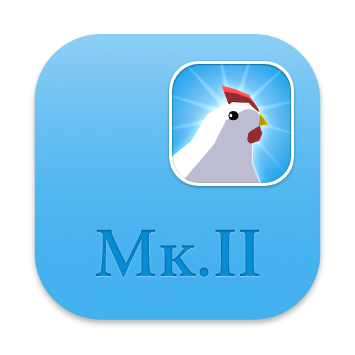
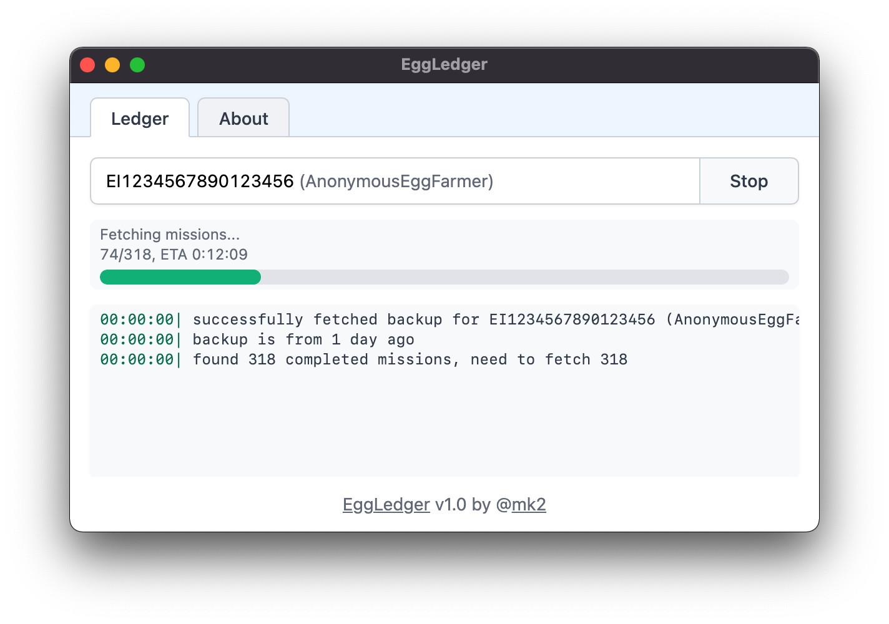

<h1 align="center">
  
</h1>

  
  
  
  

**EggLedger** helps export your Egg, Inc. spaceship mission data, including loot from each mission, to .xlsx (Excel) and .csv formats for further analysis. It is an extension to the [rockets tracker](https://wasmegg.netlify.app/rockets-tracker/), answering questions like "from which mission did I obtain this legendary artifact?" and "how many of this item dropped from my ships?" which can't be answered there due to technical or UI limitations.

[**Download now**](https://github.com/fanaticscripter/EggLedger/releases).

  

## Security and privacy

**When I use EggLedger, are my data shared with anyone?**

No. EggLedger communicates with the Egg, Inc. API directly, meaning all your data is kept 100% private. No data or analytics is collected by the EggLedger developer. The only third party request is the occasional update check against github.com; this is the biggest open source code hosting service, there is no personal data attached to the requests and no logs are available to me. Unless you tell me over another channel, there's no way I can determine if you're even using this tool, let alone acquiring collecting any info about your account.

**Are there risks to my account if I use EggLedger?**

I'm not aware of any negative effects, and [rockets tracker](https://wasmegg.netlify.app/rockets-tracker/) has been safely operating with the same techniques for a very long time. Do realize that none of my tools are sanctioned by the Egg, Inc. developer, so you use them at your own risk. I'm not responsible for any negative effects.

*You can find answers to more frequently asked questions in the About tab when you install the app.*

## License

The MIT License. See COPYING.

## Contributing

This repository is not open contribution. If you have ideas, please [run them through me first](https://wasmegg.netlify.app/#/contact).
